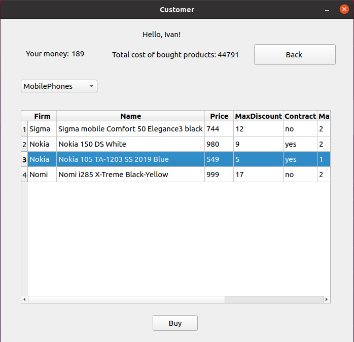
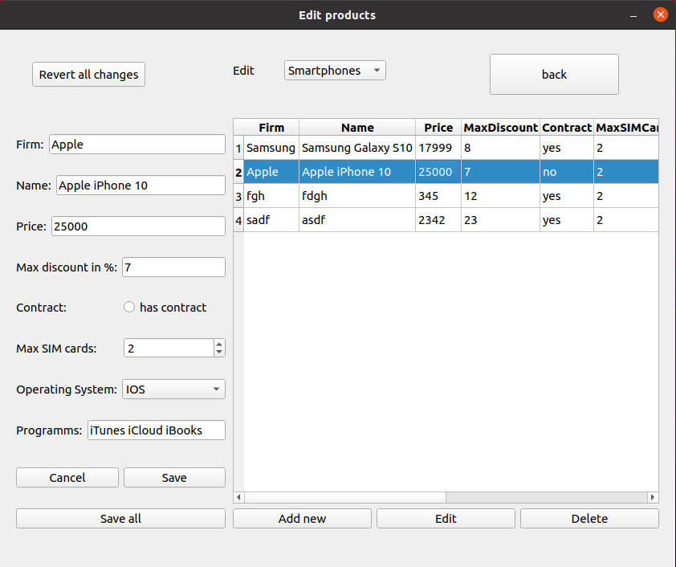

# CourseWorkHypermarket
First grade course work. OOP.

Customer window:


Owner window:


## Run project
1. ### clone 
```
$ git clone https://github.com/ashnaider/CourseWorkHypermarket.git
```
2. ### build
If you want to edit code or build it yourself, you can open CourseWorkHypermarket.pro file in Qt creator.
Binary file from GUIproject/build directory was compiled in Ubuntu 20.04 

3. ### run 
To run programm on Linux (X11), go to GUIproject/build and run programm 
```
$ cd CourseWork/GUIproject/build
$ ./CourseWorkHypermarket
```
